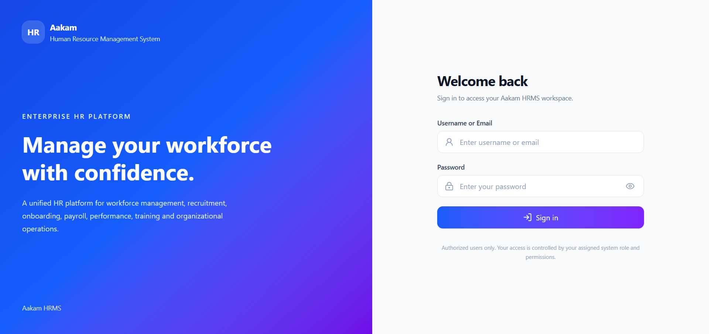
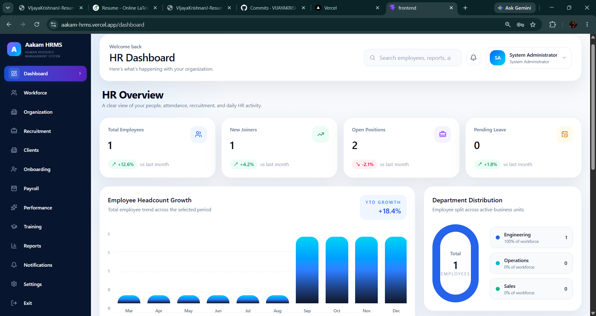
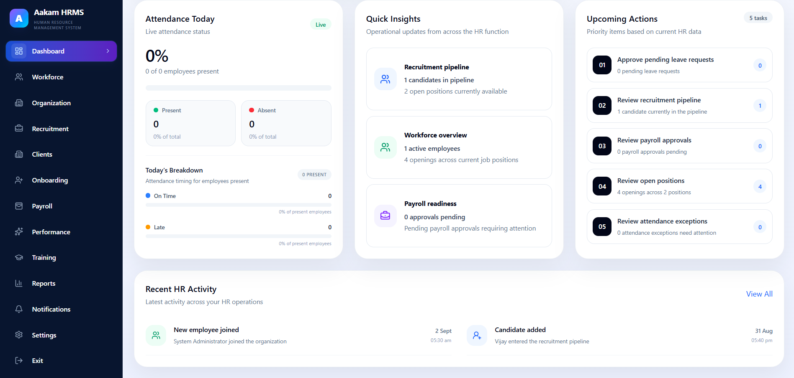
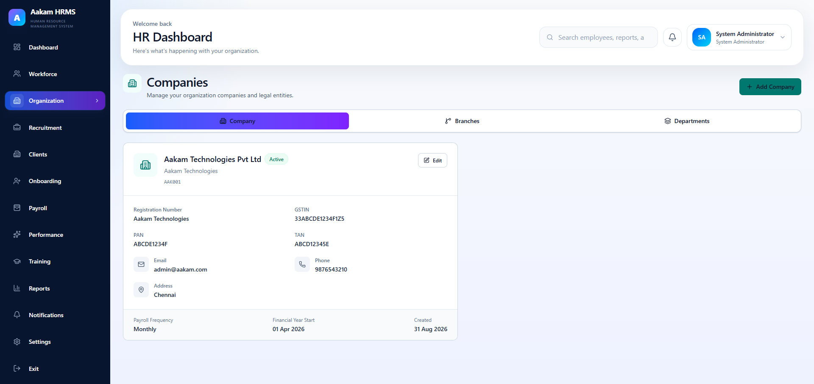
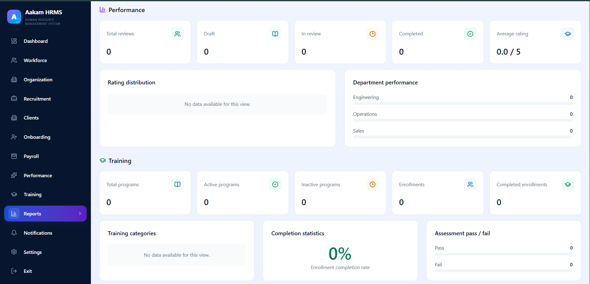
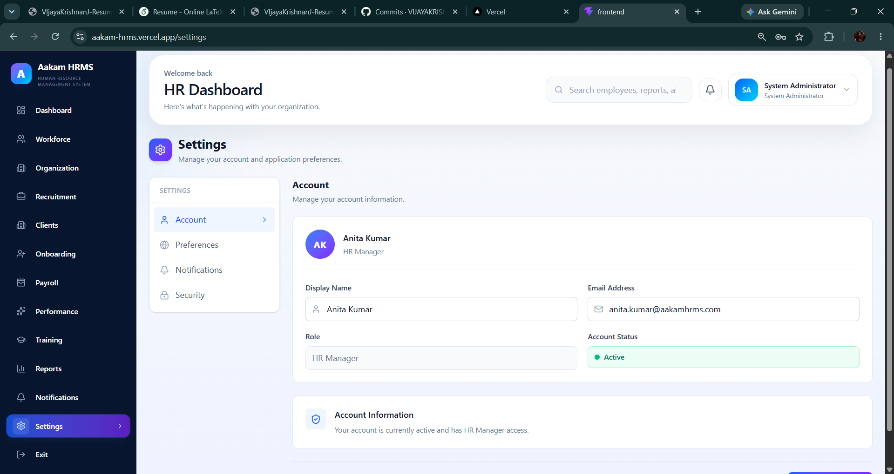

# 🚀 Aakam HRMS

A modern full-stack Human Resource Management System designed to simplify and centralize HR operations. Aakam HRMS helps organizations manage employees, recruitment, onboarding, payroll, performance, training, organization structure, reports, notifications, and other day-to-day HR activities through a single platform.

## 🚀 Live Demo

🔗 [**https://aakam-hrms.vercel.app/login**](https://aakam-hrms.vercel.app/login)

---

## 📸 Screenshots

### 🔐 Login Page



### 📊 HR Dashboard



### 🎯 Recruitment Management



### 🏢 Organization Management



### 📑 HR Reports



### ⚙️ Settings



---

## ✨ Features

- 👥 Employee and workforce management
- 🏢 Company management
- 🌿 Branch management
- 🏷️ Department management
- 🎯 Recruitment management
- 💼 Job position management
- 👤 Candidate management
- 🔄 Recruitment pipeline management
- 📋 Employee onboarding
- 💰 Payroll management
- 📊 Performance management
- 🎓 Training management
- 👥 Client management
- 🚪 Employee exit management
- 🔔 Notifications
- 📑 HR reports
- 📈 Dashboard analytics
- 👤 User management
- 🔐 Secure authentication
- 🛡️ Role-based access control
- 🔑 Permission-based authorization
- 🏢 Multi-company / tenant isolation
- 📝 Audit logging
- 🔎 Search and filtering
- 📱 Responsive user interface

---

## 🔐 Authentication & Authorization

Aakam HRMS uses secure authentication and authorization mechanisms to control access to HR operations.

The system includes:

- 🔐 User login and authentication
- 🎫 JWT-based authentication
- 🔒 Password hashing
- 🛡️ Protected routes
- 👮 Role-based access control
- 🔑 Permission-based authorization
- 📝 Login history
- 📋 Audit logging
- 🏢 Company/tenant-based access control

---

## 🏢 HR Management Modules

Aakam HRMS provides multiple modules for managing different areas of human resources.

### 👥 Workforce Management

Manage employee information, employment details, departments, positions, and workforce records.

### 🏢 Organization Management

Manage companies, branches, departments, and organizational structure.

### 🎯 Recruitment Management

Manage job positions, candidates, recruitment activities, and the hiring pipeline.

### 📋 Employee Onboarding

Manage employee onboarding activities and track the onboarding process.

### 💰 Payroll Management

Manage payroll-related records and payroll operations.

### 📊 Performance Management

Manage employee performance-related information and performance activities.

### 🎓 Training Management

Manage training programs and employee training activities.

### 👥 Client Management

Manage client-related information within the HR management system.

### 🚪 Exit Management

Manage employee exit records and related exit activities.

### 🔔 Notifications

Provide users with notifications and important HR updates.

### 📑 Reports

View HR-related reports and organizational information through the reporting module.

---

## 📊 Dashboard & Analytics

The Aakam HRMS dashboard provides an overview of important HR activities and workforce information.

The dashboard includes information such as:

- 👥 Employee statistics
- 🆕 New joiners
- 💼 Recruitment information
- 📋 Pending HR activities
- 📈 Workforce analytics
- 🏢 Department information
- 💰 Payroll information
- 🎯 Recruitment pipeline
- 📌 Upcoming activities
- 📰 Recent HR activity

---

## 🛡️ Multi-Company & Role Management

Aakam HRMS supports company-based data separation and role-based access.

The system provides different levels of access for different users and allows permissions to be associated with roles.

This helps ensure that users can access the HR functionality relevant to their responsibilities and organization.

---

## 🛠️ Tech Stack

### Frontend

- React
- TypeScript
- Vite
- Tailwind CSS
- React Router
- Axios
- Lucide React

### Backend

- Node.js
- Express.js
- JavaScript
- PostgreSQL
- pg
- JSON Web Token
- bcryptjs
- dotenv
- CORS

### Database

- PostgreSQL
- SQL
- Database migrations
- Seed data
- Role and permission management

### Development Tools

- Git
- GitHub
- npm
- ESLint
- VS Code

### Deployment

- Vercel

---

## 📦 Installation

```bash
git clone YOUR_GITHUB_REPOSITORY_URL
cd Aakam-HRMS
````

### Frontend

```bash
cd Frontend
npm install
npm run dev
```

### Backend

```bash
cd Backend
npm install
npm run dev
```

---

## 🔑 Environment Variables

Create the required `.env` files for the frontend and backend.

### Backend

```env
DATABASE_URL=your_database_url
JWT_SECRET=your_jwt_secret
JWT_EXPIRES_IN=8h
PORT=5000
```

### Frontend

```env
VITE_API_BASE_URL=your_backend_api_url
```

> ⚠️ Never commit your actual `.env` files, database credentials, JWT secrets, passwords, or other sensitive information to GitHub.

---

## 🗄️ Database

Aakam HRMS uses PostgreSQL as its relational database.

The database contains data related to:

* Users
* Roles
* Permissions
* Employees
* Companies
* Branches
* Departments
* Job positions
* Candidates
* Leave requests
* Attendance
* Payroll
* Performance
* Training
* Onboarding
* Employee exits
* Clients
* Notifications
* Login history
* Audit logs

Database schema, migrations, and seed files are maintained within the backend project.

---

## 📁 Project Structure

```text
Aakam-HRMS/
├── Frontend/
│   ├── public/
│   ├── src/
│   │   ├── components/
│   │   ├── context/
│   │   ├── pages/
│   │   ├── services/
│   │   ├── assets/
│   │   └── ...
│   ├── package.json
│   ├── vite.config.ts
│   └── eslint.config.js
│
├── Backend/
│   ├── database/
│   ├── middleware/
│   ├── routes/
│   ├── utils/
│   ├── db.js
│   ├── server.js
│   └── package.json
│
├── ScreenShots/
│   ├── Login.png
│   ├── Dashboard.png
│   ├── Dashboard2.png
│   ├── Organization.png
│   ├── Reports.png
│   └── Settings.png
│
├── .gitignore
└── README.md
```

---

## ⚙️ Development

Run the frontend:

```bash
cd Frontend
npm run dev
```

Run the backend:

```bash
cd Backend
npm run dev
```

For the backend production/start command:

```bash
npm start
```

---

## 🌐 Deployment

The Aakam HRMS frontend is deployed using Vercel.

🔗 [**Aakam HRMS Live Application**](https://aakam-hrms.vercel.app/login)

The deployed application communicates with the backend API using the configured API base URL.

Environment variables must be configured correctly in the deployment environment.

---

## 📊 How It Works

1. 🔐 User logs into Aakam HRMS
2. 🛡️ Authentication and permissions are verified
3. 📊 User accesses the HR dashboard
4. 👥 Workforce information is managed
5. 🏢 Companies, branches, and departments are managed
6. 🎯 Recruitment activities are managed
7. 📋 Employee onboarding is tracked
8. 💰 Payroll information is managed
9. 📊 Performance and training activities are managed
10. 🚪 Employee exit activities are managed
11. 📑 HR reports provide organizational information
12. 🔔 Notifications provide important updates
13. 📝 Audit and login history support administrative tracking

---

## 🎯 Project Purpose

Aakam HRMS is designed to provide organizations with a centralized platform for managing their human resource operations.

The project aims to reduce manual HR processes, improve workforce visibility, centralize employee information, streamline recruitment and onboarding, manage payroll and performance activities, and provide useful HR reports and analytics through a modern web application.

---

## 👨‍💻 Author

**Vijaya Krishnan J**

* GitHub: [https://github.com/VIJAYAKRISHNANJ](https://github.com/VIJAYAKRISHNANJ)

---

⭐ If you found this project useful, consider giving it a star!

```

This is the **style you were asking for**: same kind of flow as VijayX — **title → description → live demo → screenshots → features → modules → tech stack → installation → environment → structure → development → deployment → how it works → purpose → author** — without making the README unnecessarily complicated.
```
